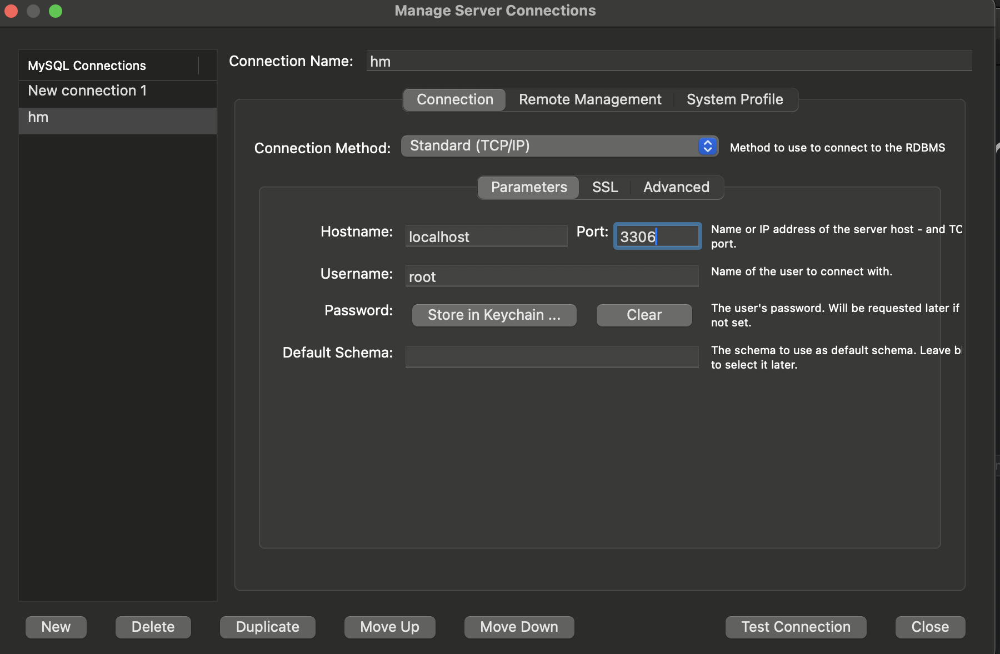

# Iniciar seu projeto

## Scripts

No terminal do projeto vc deve rodar os seguintes comando
---

### FRONT
### `npm i`

---
### BACK
### `docker-compose up --force-recreate --build`

## agora acesse seu mysql workbench e deixe como esta na foto

### senha: root
---
### por fim rode o projeto pelo Intelij